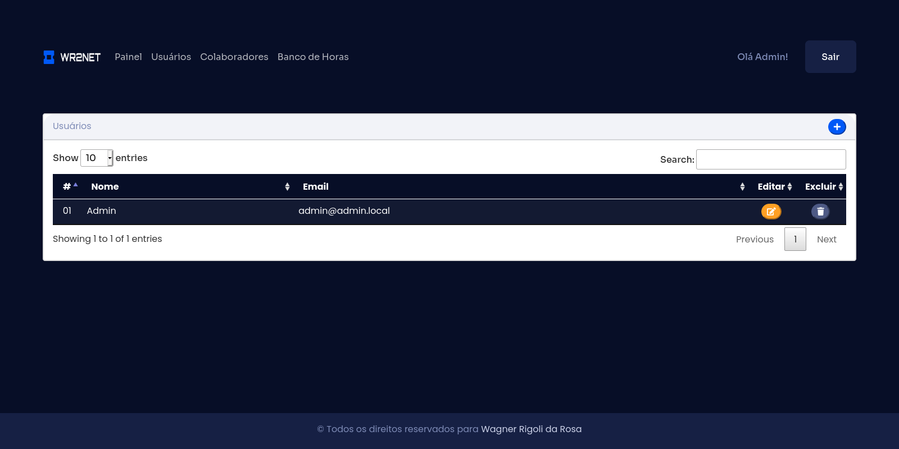

# Desafio sistema de banco de horas

## Objetivo
Criar um sistema para lançamento de horas sem uso de framework. 

## Instalando dependências:
`composer install`

## Banco de Dados
* Crie um banco de dados MySQL para o sistema.
* Import o banco de dados disponibilizado em /storage/database/

#### Para importar vai terminal
* `$ mysql -uroot -p` \
* `enter` \
* `mysql> USE 'nome-do-banco'` \ 
* `enter` \
* `source /path/file.sql` \
* `enter` \

## Enviroments
Altere o nome do arquivo `.env.example` na raiz do projeto para `.env` e insira os dados solicitados

## Subindo o servidor
Acesse o diretório raiz do projeto e execute o comando abaixo: \
`php -s localhost:8088`

## Acessando o sistema
* Acesse em seu navegador o endereço http://localhost:8088
* Clique em Acesso
* Insira os dados de acesso e clique em entrar

#### Dados de acesso default
Login: admin@admin.local \
Senha: 123456

## Telas do Sistema

